# ML application on ESP32-S3-EYE (Image classification for Plant Health Monitoring) 
Hardware Setup

The workflow is as follows:

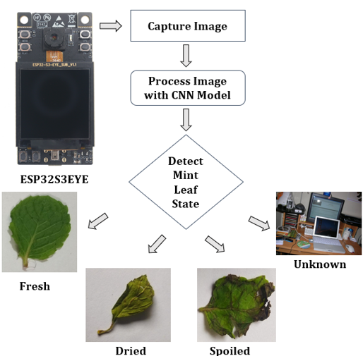

CNN Model architecture

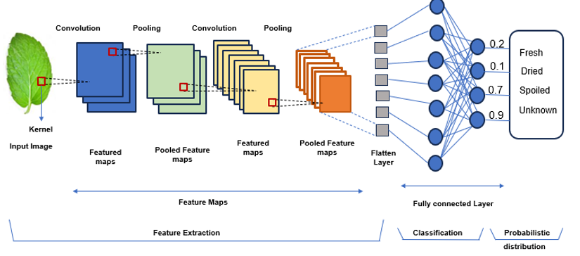

Dataset

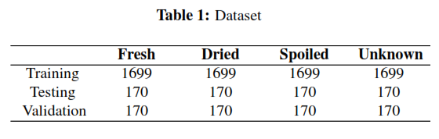

Model Performance

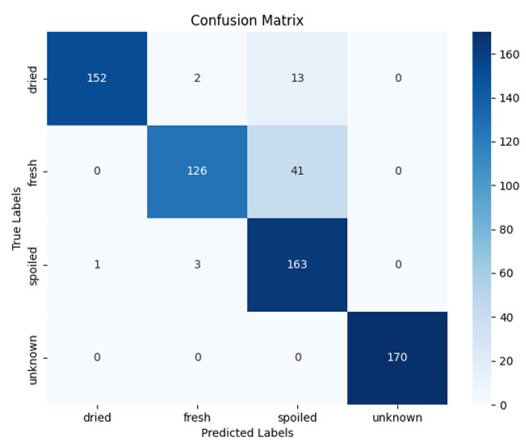

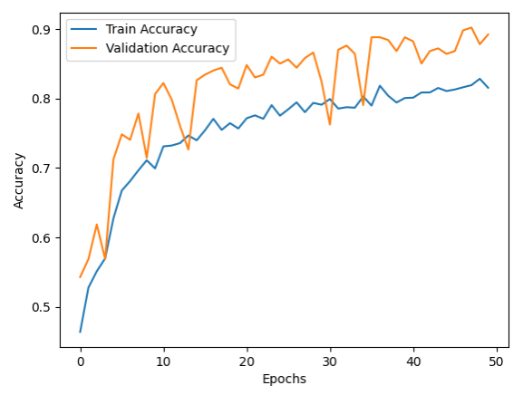
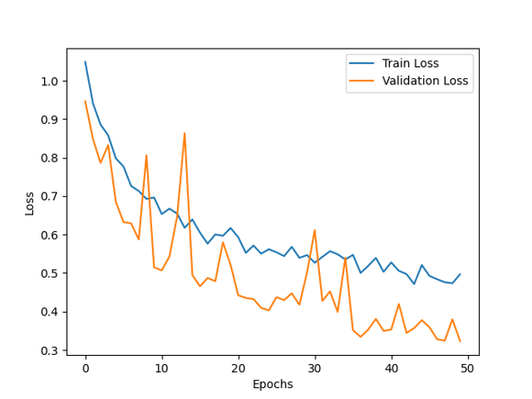

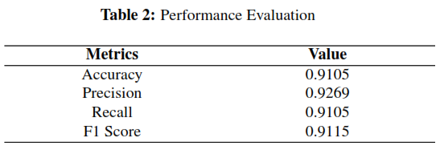

Images after data augmentation

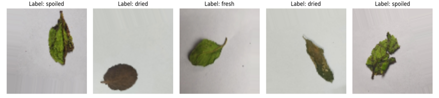

Sample Predictions

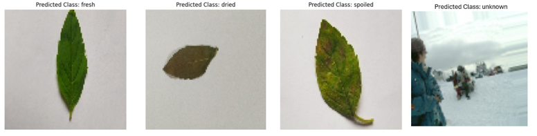

RESULTS:

Detection Result of Mint leaves for various categories on LCD

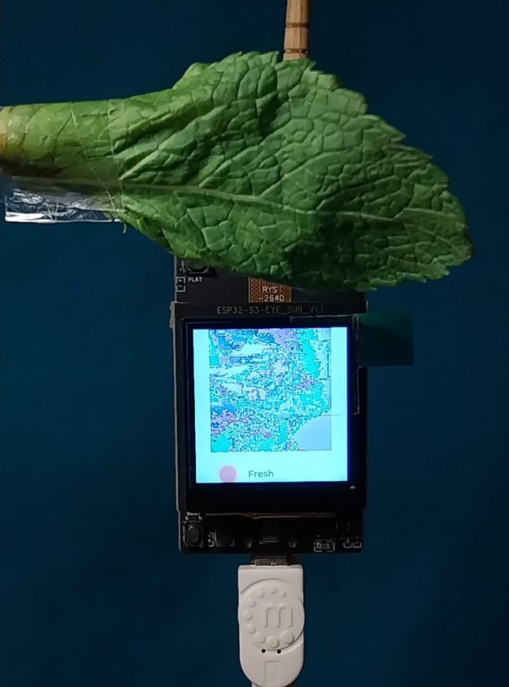

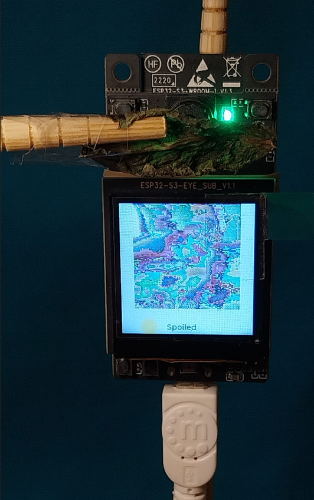
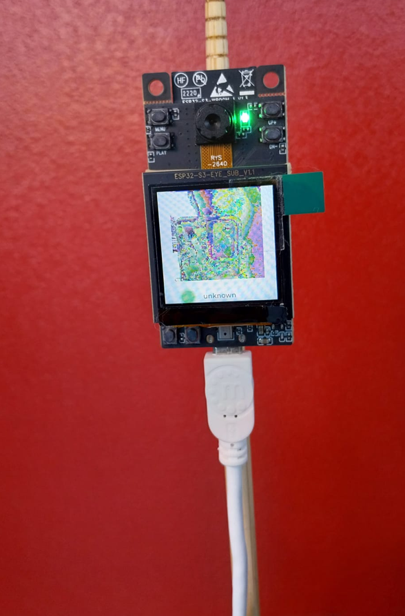

Serial Port output

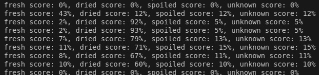