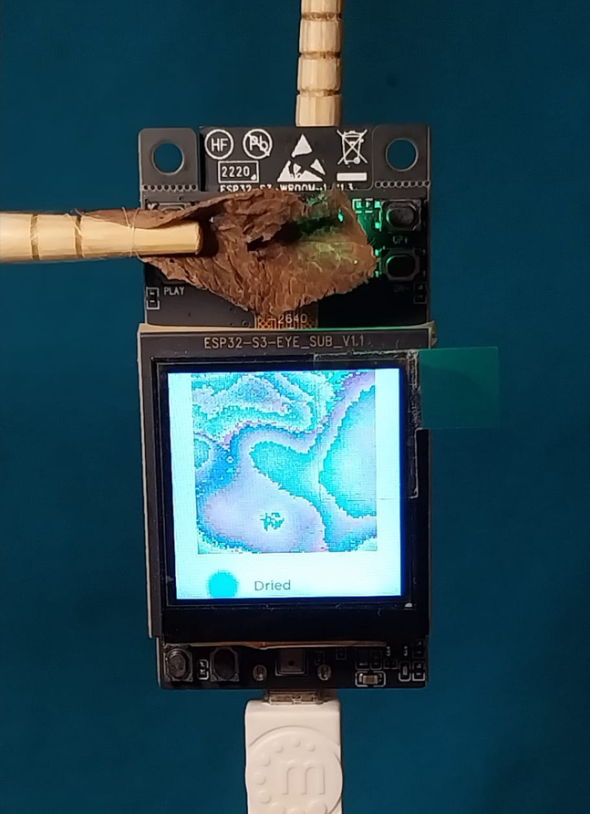

# ML application on ESP32-S3-EYE (Image classification for Plant Health Monitoring) 
Hardware Setup

The workflow is as follows:

CNN Model architecture

Dataset

Model Performance

Images after data augmentation

Sample Predictions

RESULTS:

Detection Result of Mint leaves for various categories on LCD

Serial Port output

